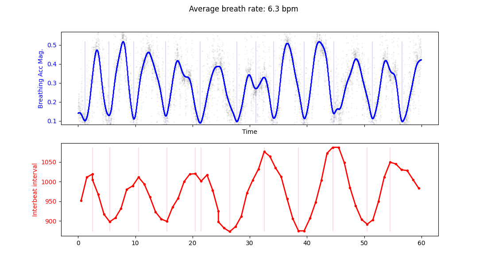
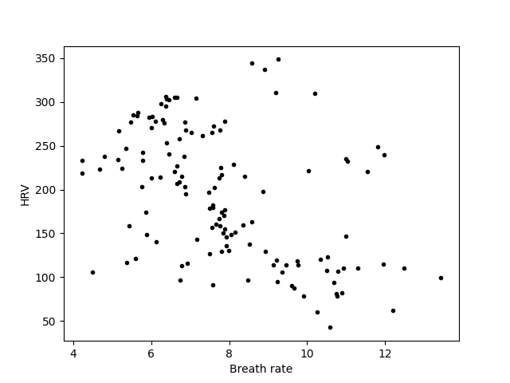

# Don't Hold Your Breath – Breathing analysis with Polar H10 Heart Rate Monitor

A person's heart rate fluctuates based on factors such as activity, environment, and mental state. Additionally, heart rate variations occur on a much shorter timescale, with changes happening every few seconds. During inhalation, heart rate slightly increases, and it decreases again during exhalation, a phenomenon known as respiratory sinus arrhythmia. There are several reasons for this. Firstly, an increase in volume within the thoracic cavity (the space between the ribs) leads to a corresponding drop in pressure, which is counteracted by a rise in heart rate to regulate blood pressure. Secondly, breathing is deeply intertwined with the autonomic nervous system, which involves the opposing activation of the parasympathetic ("rest and digest") and sympathetic ("fight or flight") responses. By measuring heart rate variability and regulating our breath, we can gain insight into our stress response and learn to control it.

The Polar H10 heart rate monitor provides basic heart rate measurements from a chest strap ECG, compatible with a number of fitness tracking apps that monitor heart rate zones wirelessly using bluetooth. The device also provides raw sensor data including an accurate measure of the timing between heartbeats (interbeat interval, with millisecond resolution) and 200 Hz accelerometer data. In this project this information is used to measure breathing rate and heart rate variability, and explore the relationship between the two.

## Features

- Connect to a Polar H10 heart rate monitor, simultanesouly record accelerometer and heart rate data (interbeat interval)
- Calculate and breathing rate and heart rate varability
- Visualised trends in breath rate and heart rate varability to explore the br-hr relationship

## Installation
    
    python -m venv venv
    source venv/bin/activate  # On Windows, use `my_project_env\Scripts\activate`
    pip install -r requirements.txt

## Usage

    python DHYB.py --use-sample-data --record-time 20

    options:
    --use-sample-data     Use sample data loaded from a file
    --record-len 20       Length of recording in seconds

The program will automatically connect to the first Polar BLE device it is able to find (if --use-sample-data is not set)
For best breathing detection, ensure the Polar H10 is fitted around the widest part of the ribcage

## Example output
Oscillating breathing signal based on accelerometer output, and the oscillating interbeat interval signal as heart rate changes with each breath

Trends in heart rate variability as breathing rate changes. Slower breathing tends to increase heart rate variability

The relationship between heart rate variability and breathing rate to understand breathing and heart rate synchronisation

## Contributing
Feedback, bug reports, and pull requests are welcome. Feel free to submit an issue or create a pull request on GitHub.

